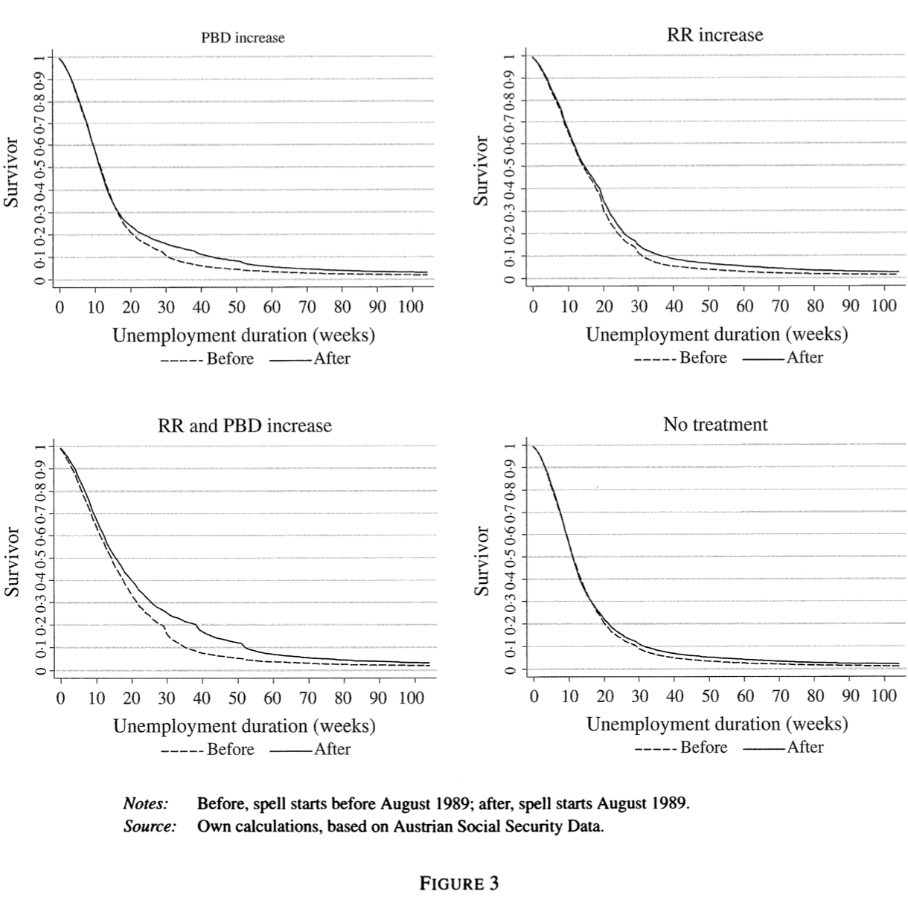
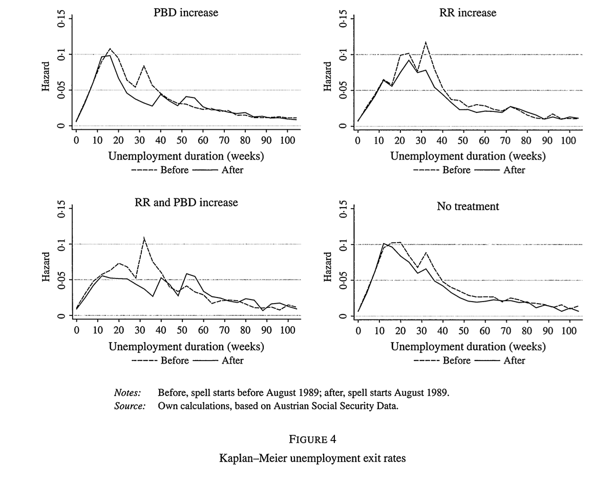

## 1 Research objectives
The study titled "How Changes in Financial Incentives Affect the Duration of Unemployment" by Rafael Lalive, Jan van Ours, and Josef Zweimüller explores the impact of alterations in unemployment insurance parameters on the duration of unemployment. Published in The Review of Economic Studies in 2006, the authors investigate two crucial parameters: the benefit replacement rate (RR) and the potential benefit duration (PBD).

The primary objective of the study is to examine how variations in these parameters influence the duration of unemployment, aligning with established literature in labor economics and social policy. Previous research has delved into the relationship between unemployment benefits and job search behavior, highlighting the importance of financial incentives in shaping individuals' decisions regarding job search intensity and duration of unemployment. By focusing on specific policy changes implemented by the Austrian government in 1989, which affected different groups of unemployed individuals, the study aims to provide empirical evidence on the behavioral responses to alterations in benefit levels and duration.

One notable aspect of the empirical strategy employed in this study is the use of a policy change as a natural experiment to identify the causal effect of changes in RR and PBD on unemployment duration. The authors exploit the heterogeneity in the treatment groups resulting from the policy change, allowing for a credible estimation of the impact of altered financial incentives on unemployment duration. This approach adds novelty to the study by providing quasi-experimental evidence on the causal relationship between unemployment insurance parameters and job search behavior.

The results of the study indicate that unemployed individuals respond to changes in financial incentives by adjusting their behavior, leading to an increase in the duration of unemployment. These findings are consistent with the predictions of job search theory, suggesting that individuals weigh the costs and benefits of job search activities in light of changes in unemployment insurance parameters. The authors also conduct a decomposition analysis to quantify the costs to unemployment insurance funds attributable to changes in policy parameters versus behavioral responses of unemployed individuals. The results suggest that the costs associated with behavioral responses are substantial, underscoring the importance of considering individuals' reactions to policy changes in designing effective unemployment insurance systems.

Overall, the study contributes to the literature by providing empirical evidence on the causal relationship between changes in financial incentives and the duration of unemployment. By employing a rigorous empirical strategy and leveraging a natural experiment, the study offers insights into the behavioral responses of unemployed individuals to alterations in unemployment insurance parameters. These findings have implications for policymakers in designing effective labor market policies aimed at reducing unemployment duration while minimizing adverse effects on welfare recipients.

## 2 Background
The authors aim to discern the causal impact of benefit duration on individuals' job acceptance propensity, leveraging a policy shift occurring in Austria in 1989. This policy alteration affected distinct subsets of unemployed individuals: one group encountered a rise in Replacement Rate (RR), another group saw an extension in Potential Benefit Duration (PBD), a third group experienced both adjustments, while a fourth group, the control, underwent no alteration.

The extension in potential benefit duration varied based on age and work experience: younger workers under 40 with limited prior work experience witnessed no change in potential benefit duration, whereas those with substantial work experience observed an increase in duration.

## 3 Data Preparation

The dataset contains 225,821 unemployment spells and 148 variables.
```{r echo=FALSE, warning=FALSE, include=FALSE}
#Loading the packages
library(foreign)  
library(tidyverse)
library(survival)
library(kableExtra)
library(KernSmooth)
library(stargazer)
library(devtools)
library(parfm)
library(expm)

#Loading the dataset
setwd("/Users/coraline/Desktop/Master2/Transition models and duration/Midterm")
udat <- read.dta("fi.dta")  
udat <- udat[,1:134] ## get rid of some superfluous variables
udat <- as_tibble(udat)

dim(udat)  ## N = 225,821
```


```{r echo=FALSE, warning=FALSE}
## Computation of average spells when durations are truncated at 104 weeks
udat %>%
  mutate(dur104 = dur,
         dur104 = ifelse(dur104 > 104, 104, dur104)) ->
  udat
```
The Regression Discontinuity Design (RDD) structure is outlined as follows: Prior to August 1, 1989, the Potential Benefit Duration (PBD) stood at 20 weeks, with the Replacement Rate (RR) hovering around 41%. Post-August 1, 1989, RR surged to approximately 47%. Moreover, PBD ceased to rely solely on prior contributions but also on the individual's age at the onset of the unemployment period. Specifically, for individuals aged 40-49, benefit duration expanded to 39 weeks (provided the individual had been unemployed within the preceding 10 years). For those aged 50 and above, PBD increased to 52 weeks.


## 4 Difference-in-differences
Table 4 provides the average length of unemployment during the initial 104 weeks, classified by employment status and group. The initial column displays that the average duration is lengthiest in the ePBD-RR group and shortest in the control group for spells originating before August 1989. The third column indicates a rise in unemployment duration across all groups. For instance, the duration increases more prominently by 1.08 weeks (compared to 1.13 as stated in the research paper) in the ePBD group, which is eligible for the extension of PBD but not for the RR increase.

When replicating Table 4 from the paper, we observe slightly divergent outcomes. Here is the table that they obtain:

```{r echo=FALSE}
pbd<- udat$type

udat <- udat %>%
  mutate(epbd = ifelse(pbd == "PBD", 1, 0),
         err = ifelse(pbd == "RR", 1, 0),
         epbd_rr = ifelse(pbd == "PBD and RR", 1, 0),
         control_group = ifelse(pbd == "control", 1, 0))

udat <- udat %>%
  mutate(epbd_before = ifelse(after == 1 & epbd == 1, 1, 0),
         epbd_after = ifelse(after == 1 & epbd == 1, 0, 1),
         err_before = ifelse(after == 1 & err == 1, 1, 0),
         err_after = ifelse(after == 1 & err == 1, 0, 1),
         epbd_rr_before = ifelse(after == 1 & epbd_rr == 1, 1, 0),
         epbd_rr_after = ifelse(after == 1 & epbd_rr == 1, 0, 1),
         control_group_before = ifelse(after == 1 & control_group == 1, 1, 0),
         control_group_after = ifelse(after == 1 & control_group == 1, 0, 1))


```

```{r echo=FALSE, warning=FALSE}
stat_desc<- udat%>% select(type, dur104, after)

stat_moyenne <- stat_desc %>%
  group_by(type, after) %>%
  summarise(moyenne_dur104 = mean(dur104))

```
And here is the table that I obtain:
```{r echo=FALSE, warning=FALSE}
stat_moyenne <- stat_desc %>%
  group_by(type, after) %>%
  summarise(moyenne_dur104 = mean(dur104),
            .groups = "drop") %>%
  pivot_wider(names_from = after,
              values_from = moyenne_dur104) %>%
  mutate(Change = `1` - `0`)%>%
  rename(Before = `0`, After = `1`)

#Regression DID
did_reg<- lm(dur104~ epbd_rr+ epbd+ err+ after*(epbd_rr+ epbd+ err)+ after, data=udat)

coefficients_did<- coef(did_reg)
coefficients_selected <- coefficients_did[(length(coefficients_did) - 2):length(coefficients_did)]
coefficients_selected <- c(coefficients_selected, 0)

stat_table <- stat_moyenne %>%
  mutate(Diff_in_Diff= coefficients_selected) %>% 
  kbl(caption = "Average unemployment duration in first 104 weeks") %>%
  kable_classic(full_width = FALSE) %>%
  kable_styling()
stat_table
```


## 5 Survival Function

The figure 3 that we want to replicate displays the Kaplan-Meier survivor functions for four distinct groups. The graph contrasts the survivor function after the policy change with the survivor function in the group that did not experience a change in potential benefit duration (PBD). Notably, after approximately 15 weeks of unemployment, the survivor function following the policy change begins to diverge from the corresponding function prior to the change. This disparity continues to widen until around 40 weeks of unemployment have elapsed, after which it stabilizes at a lower level until the exhaustion of benefits in the new system, about 15 weeks post-change.

The top right subfigure of Figure 3 illustrates the difference in the survivor functions between groups. Contrary to previous observations, a slight increase in the survivor function is noted almost immediately at the onset of unemployment. This disparity between survivor functions grows notably after 20 weeks of unemployment, with the survivor function remaining at a higher level than before the policy change even after benefits have been exhausted, specifically after week 30.

The bottom left subfigure presents the survivor function for the group affected by changes in the benefit replacement rate (RR). This figure reflects a combination of effects from both policy changes, with a noticeable increase in the survivor function right from the beginning of the unemployment spell. Similarly, a "lens" effect emerges after 15 weeks of unemployment and persists until around 65 weeks of unemployment duration.

In the bottom right panel, the survivor functions for the "control" group are depicted. No discernible difference in survivor functions is observed within the first 20 weeks of unemployment; however, a slight upward shift in the survivor function is evident thereafter. Thus, to isolate the effects of changes in the unemployment compensation system introduced in August 1989, it is crucial to consider the temporal evolution of these effects on survivor functions across different subgroups.

Here are the figure they obtain:

When replicating this figure it leads to the graphs below. They are very similar to what the authors got.

```{r echo=FALSE}
survival_data<- udat %>% 
  group_by(type) %>% 
  group_split


par(mfrow= c(2,2))

#PBD
survival1<- survfit(Surv(dur104[after0==0])~1, data= survival_data[[2]])
survival11<- survfit(Surv(dur104[after0==1])~1, data= survival_data[[2]])

plot(survival11, lty=1, xlab= "Unemployment duration (weeks)", ylab="Survivor", main= "PBD", conf.int = FALSE)
lines(survival1, lty=2, conf.int = FALSE)
legend("topright", legend=c("After", "Before"), lty = 1:2)

#RR
survival2<- survfit(Surv(dur104[after0==0])~1, data= survival_data[[3]])
survival22<- survfit(Surv(dur104[after0==1])~1, data= survival_data[[3]])

plot(survival22, lty=1, xlab= "Unemployment duration (weeks)", ylab="Survivor", main= "RR", conf.int = FALSE)
lines(survival2, lty=2, conf.int = FALSE)
legend("topright", legend=c("After", "Before"), lty = 1:2)


#PBD and RR
survival3<- survfit(Surv(dur104[after0==0])~1, data= survival_data[[1]])
survival33<- survfit(Surv(dur104[after0==1])~1, data= survival_data[[1]])

plot(survival33, lty=1, xlab= "Unemployment duration (weeks)", ylab="Survivor", main= "PBD and RR", conf.int = FALSE)
lines(survival3, lty=2, conf.int = FALSE)
legend("topright", legend=c("After","Before"), lty = 1:2)

#Control 
survival4<- survfit(Surv(dur104[after0==0])~1, data= survival_data[[4]])
survival44<- survfit(Surv(dur104[after0==1])~1, data= survival_data[[4]])

plot(survival44, lty=1, xlab= "Unemployment duration (weeks)", ylab="Survivor", main= "Control", conf.int = FALSE)
lines(survival4, lty=2, conf.int = FALSE)
legend("topright", legend=c("After","Before"), lty = 1:2)
```


### 5.1 KM estimates of the unemployment exit hazard

Lalive et al. (2006) also provide hazard estimates derived from Kaplan-Meier (KM) estimates, as illustrated in Figure 4. However, the method used to generate these estimates appears somewhat opaque, given the remarkably smooth nature of the curves. In order to attain smoother hazard estimates, I reduced the number of points considered on the estimated survival probabilities curve Ŝ(t). For instance, opting for a finer granularity, such as one data point for each week, could significantly enhance the smoothness of the resulting hazard curves. This approach allows for a more continuous representation of the hazard function, facilitating clearer interpretation and analysis of the underlying trends in unemployment duration.

Here are the figure they obtain:


```{r echo=FALSE}
# I created a function in order to avoid repition in the code
calculate_hazard_data <- function(survival_data) {
  surv_pbd <- survival_data$surv
  surv_time <- survival_data$time
  
  surv_val <- data.frame(surv_pbd, surv_time)
  
  surv_time_weeks <- floor(surv_val$surv_time)
  unique_weeks <- unique(surv_time_weeks)
  selected_surv_values <- approx(surv_val$surv_time, surv_val$surv_pbd, xout = unique_weeks)$y
  selected_data <- data.frame(surv_time = unique_weeks, surv_pbd = selected_surv_values)
  
  ha <- -diff(selected_data$surv_pbd) / diff(selected_data$surv_time)
  hazard <- ha / selected_data$surv_pbd[-length(selected_data$surv_pbd)]
  
  hazard_data <- data.frame(selected_data[-1, ], hazard)
  hazard_data$hazard[hazard_data$hazard == Inf] <- 0
  hazard_data <- na.omit(hazard_data)
  hazard_data<- hazard_data[-103,]
  
  return(hazard_data)
}
```
 And here is my replication:

```{r echo=FALSE}
par(mfrow= c(2,2))

#PBD
hazard_pbd_av <- calculate_hazard_data(survival1)
hazard_pbd_ap <- calculate_hazard_data(survival11)

h1 <- locpoly(hazard_pbd_av$surv_time, hazard_pbd_av$hazard, degree = 3, bandwidth = 2)
h2 <- locpoly(hazard_pbd_ap$surv_time, hazard_pbd_ap$hazard, degree = 3, bandwidth = 2)
plot(h2,ylab="hazard", xlab="time (weeks)", type="l", xlim=c(0,99),ylim=c(0,0.15))
lines(h1, lty=2)

# RR
hazard_rr_av <- calculate_hazard_data(survival2)
hazard_rr_ap <- calculate_hazard_data(survival22)


# Tracer les graphiques locpoly
h3 <- locpoly(hazard_rr_av$surv_time, hazard_rr_av$hazard, degree = 3, bandwidth = 3)
h4 <- locpoly(hazard_rr_ap$surv_time, hazard_rr_ap$hazard, degree = 3, bandwidth = 3)
plot(h4,ylab="hazard", xlab="time (weeks)", type="l", xlim=c(0,99),ylim=c(0,0.15))
lines(h3, lty=2)


# PBD and RR
hazard_rp_av <- calculate_hazard_data(survival3)
hazard_rp_ap <- calculate_hazard_data(survival33)

# Tracer les graphiques locpoly
h5 <- locpoly(hazard_rp_av$surv_time, hazard_rp_av$hazard, degree = 3, bandwidth = 2)
h6 <- locpoly(hazard_rp_ap$surv_time, hazard_rp_ap$hazard, degree = 3, bandwidth = 2)
plot(h6,ylab="hazard", xlab="time (weeks)", type="l", xlim=c(0,99),ylim=c(0,0.15))
lines(h5, lty=2)


#Control
hazard_cont_av <- calculate_hazard_data(survival4)
hazard_cont_ap <- calculate_hazard_data(survival44)

# Tracer les graphiques locpoly
h7 <- locpoly(hazard_cont_av$surv_time, hazard_cont_av$hazard, degree = 3, bandwidth = 2)
h8 <- locpoly(hazard_cont_ap$surv_time, hazard_cont_ap$hazard, degree = 3, bandwidth = 2)
plot(h8,ylab="hazard", xlab="time (weeks)", type="l", xlim=c(0,99),ylim=c(0,0.15))
lines(h7, lty=2)
```


## 6 Estimating the causal treatment effect in a PH model
```{r echo=FALSE}
udat %>%
  mutate(all = tr * (t39 + t52) ) ->
  udat

breaks <- seq(from=3,to=59, by=4)
labels <- paste("(", c(0,breaks), ",", c(breaks,104), "]",sep="")

gux <- survSplit(Surv(dur104,uncc) ~., data=udat, cut = breaks,
                 end = "time", event="death", start="start", episode="interval")

gux %>%
  mutate(exposure = time - start,
        interval=factor(interval+1, labels = labels) ) ->
  gux

```


```{r echo=FALSE}

taille_echantillon <- round(nrow(gux) * 0.001)


indices_echantillon <- sample(1:nrow(gux), taille_echantillon)

echantillon_gux <- gux[indices_echantillon, ]

```

I was not able to get estimates of the causal treatment effect of the PH model because of the large size of the data and the weak ram of my laptop. Even when considering a much smaller sample it didn't finish running. After this homework I am considering changing my laptop. I let in comments the code so maybe you can make it run on your more powerful laptop.
```{r}
#Estimating the PWE model
#pwe<- parfm(Surv(dur, death) ~.,data=echantillon_gux ,dist="exponential", frailty="none")

#stargazer(pwe, 
         # dep.var.caption="",dep.var.labels="",
          #keep=1:15,
          #omit.table.layout = "n", star.cutoffs = NA,
          #keep.stat=c("n", "ll"),no.space=TRUE,
          #header=FALSE,
          #title="The PWE model", type="text"
          #)

```

